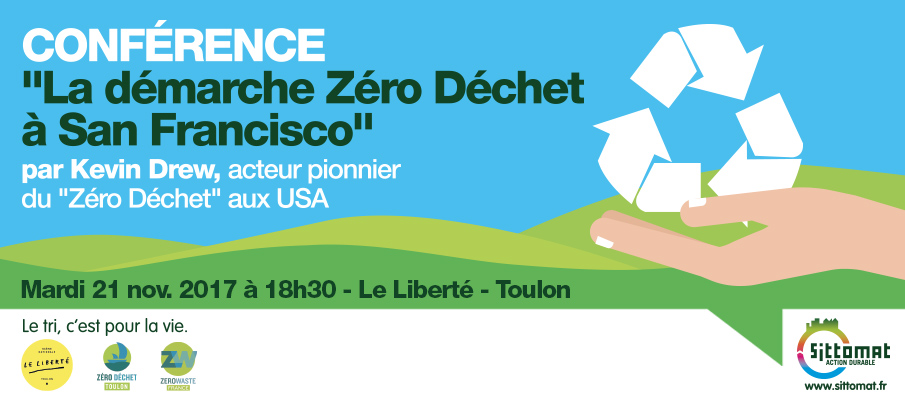

[][weezevent]

Dans le cadre de la visite en France de Kevin Drew, Coordinateur du programme Zéro Déchet du Département de l’Environnement de la ville de San Francisco, le SITTOMAT, l’association Zero Waste France et le collectif Zéro Déchet Toulon, en partenariat avec Le Liberté, Scène Nationale de Toulon, invitent citoyens et acteurs publics à assister à la conférence de Kevin Drew. Cette rencontre permettra de recueillir le témoignage de cet acteur pionnier du "Zéro Déchet" outre-Atlantique et d’échanger sur l’expérience de San Francisco. Plus de détails sur notre [page Facebook][lienfb]

[Inscription][weezevent] gratuite mais obligatoire

[lienfb]:https://www.facebook.com/events/549644475389098/
[weezevent]:https://www.weezevent.com/evenement.php?id_evenement=290437
